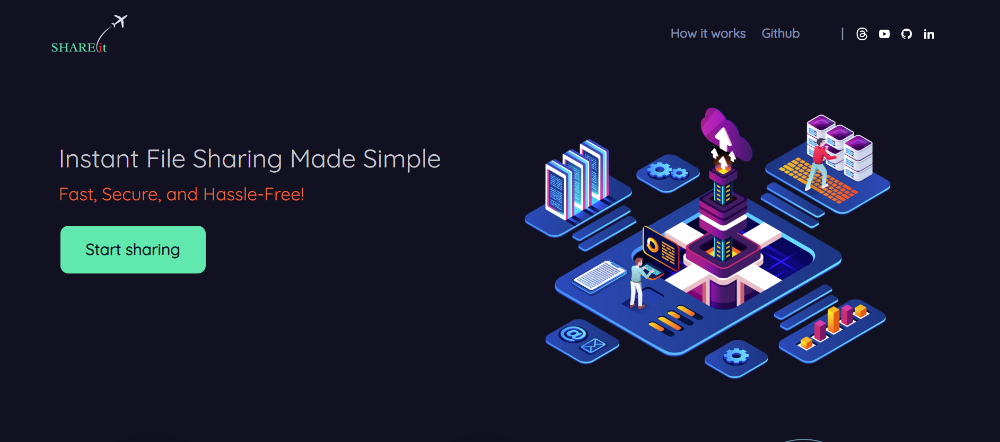
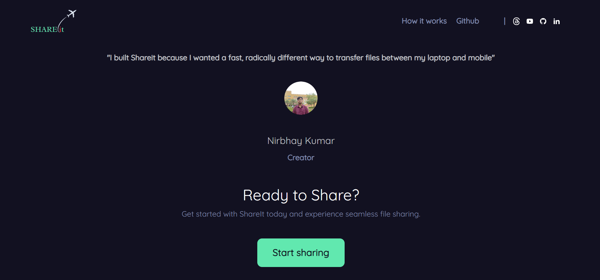
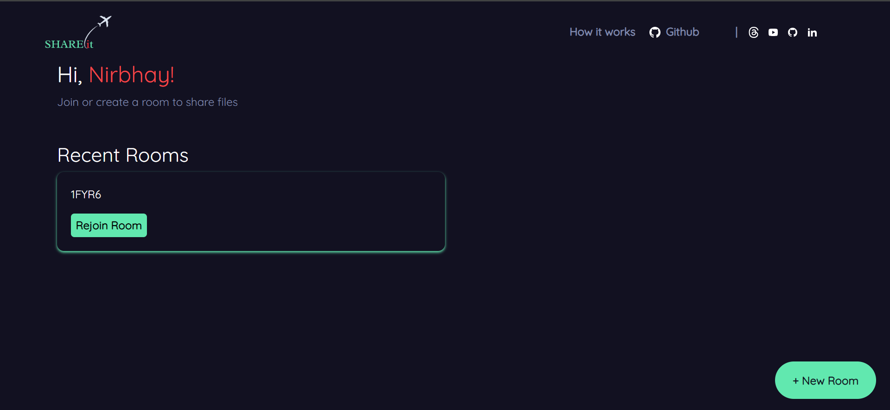
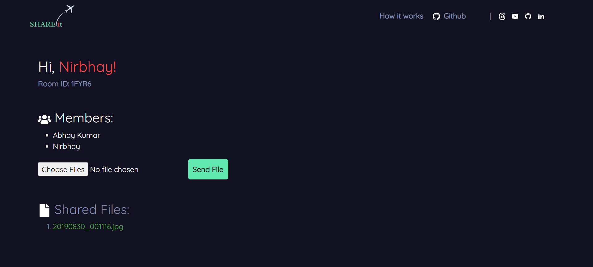
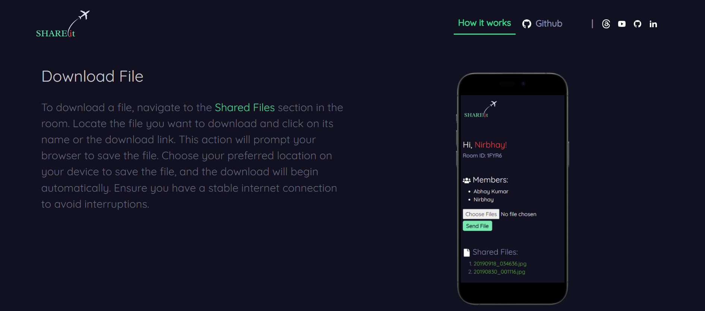

#  ShareIt - Real-Time File Sharing

## Overview

ShareIt is a real-time file sharing application built using React, Node.js, and Socket.io. This application allows users to create or join rooms to share files seamlessly and in real-time. Users can upload files, share them with specific rooms, and download shared files instantly. The app also supports user nicknames and room rejoining via recent room history.

## Features

- **🚀 Real-Time File Sharing**: Share files instantly with members in the same room.
- **💬 Nickname Support**: Identify users in the room with their unique nicknames.
- **🔗 Unique Room Creation**: Rooms created with UUIDs for easy sharing and access.
- **📂 Recent Rooms**: Quickly rejoin recent rooms from your browsing history.

## Usage

- **Access the Application**: Open your browser and navigate to http://localhost:3000.
- **Create a Room**: Click on "New Room" to generate a unique room with a UUID.
- **Join a Room**: Enter an existing room ID to join.
- **Start Sharing**: Upload and share files with members in the room. Download shared files from others.

## Screenshots


*Home Page*


*Home Page*


*Room Page*


*Sharing Room Page*


*Sharing Room Page*


## Installation

1. **Clone the repository:**
    ```bash
     git clone https://github.com/nirbhaykr87/Shareit.git
    ```

2. **Install dependencies for both client and server:**
    ```bash
    npm install
   
    ```
3. **Start the application:**
4. 
   ***Use concurrently to start both the frontend and backend servers***

    ```bash
   npm start
    ```

    The application will be available at http://localhost:3000.
 


## Future Improvements

- **🔒 Enhanced Security**: Implement authentication and authorization to secure rooms and user data.
- **🌟 File Previews**: Add support for file previews before downloading.
- **📁 File Management**: Organize and manage shared files within the app.


### Contact
For any questions or feedback, please open an issue on the repository or contact the project maintainer.


[](https://www.linkedin.com/in/nirbhaykrmuj/)


---


<p align="center"> Happy Coding! 🎉</p>
